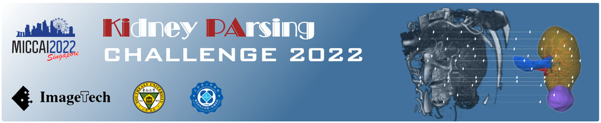
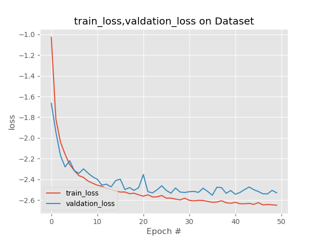
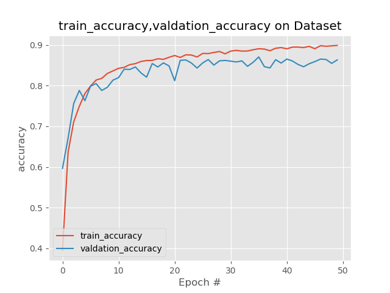
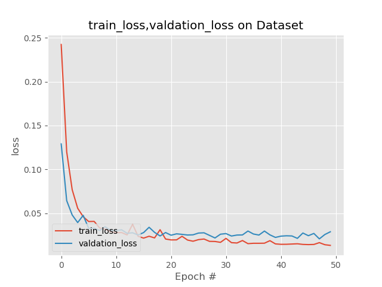
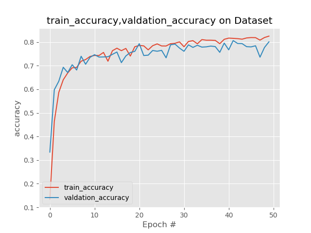
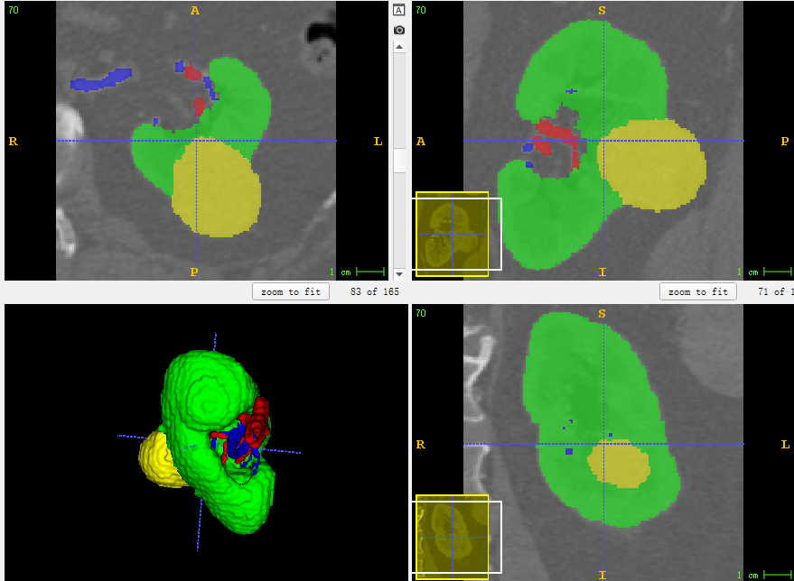
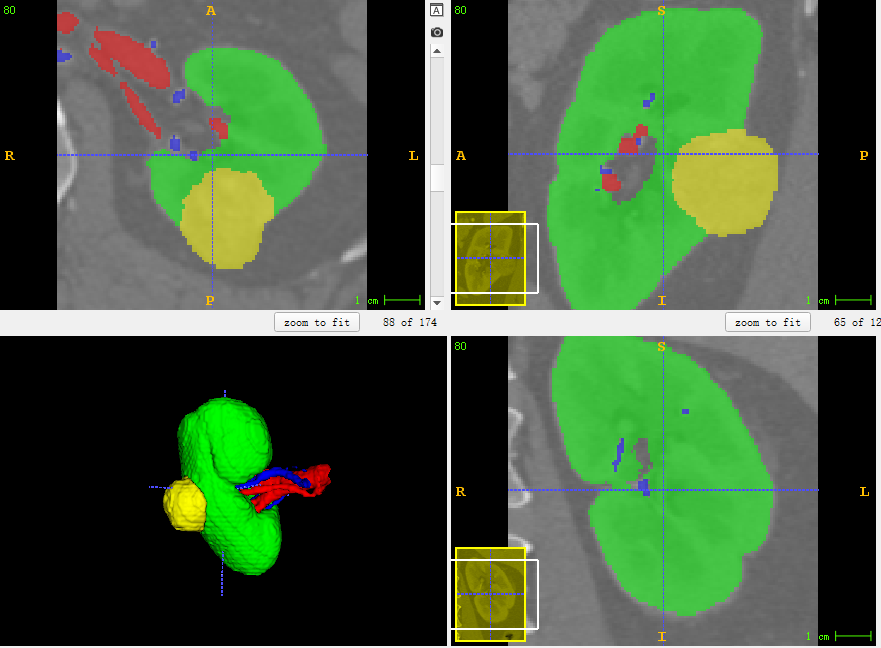
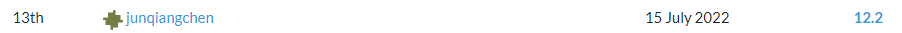

# KiPA2022-Challenge
> This is an example of the CT imaging is used to Segment Multi-Structure for Renal Cancer Treatment.

## Prerequisities
The following dependencies are needed:
- numpy >= 1.11.1
- SimpleITK >=1.0.1
- pytorch-gpu ==1.10.0
- pandas >=0.20.1
- scikit-learn >= 0.17.1

## How to Use
* 1、when download the all project,check out the data folder all csv,put your train data into same folder.or you can run data3dpreparewithSize.py to generate train data and validation data.
* 2、run train.py for Unet3d segmeatation training:make sure train data have effective path
* 3、run inference.py for Unet3d segmeatation inference:make sure test data have effective path

## Result

* dice:train loss,train accuracy,validation loss,validation accuracy

* focalloss:train loss,train accuracy,validation loss,validation accuracy

* test dataset segmentation result

* test dataset leadboard

* more detail and trained model can follow my WeChat Public article.

## Contact
* https://github.com/junqiangchen
* email: 1207173174@qq.com
* Contact: junqiangChen
* WeChat Number: 1207173174
* WeChat Public number: 最新医学影像技术
